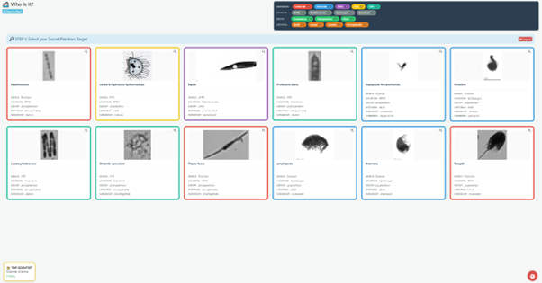
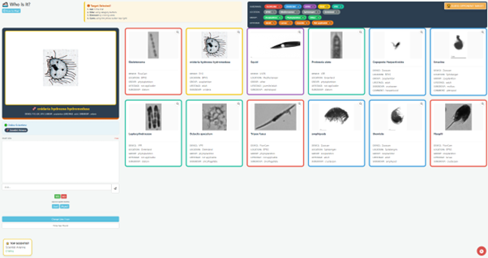

# Plankton "Who Is It?" 🦠

An interactive Shiny-based game to identify plankton and marine organisms from images. Designed for both single-player and multiplayer modes, simulating a marine laboratory experience where players act as scientists analyzing plankton specimens using advanced imaging hardware.

**Choose your target, ask strategic questions, and eliminate suspects to identify the mystery organism!**




---

## Overview

**Plankton "Who Is It?"** is an interactive educational and entertainment platform built with **Shiny** for R. It leverages a comprehensive image library of marine organisms captured by multiple imaging systems, enabling players to engage in a detective-style game where they must identify hidden plankton species through questioning and logical deduction.

The application features:
- **Real plankton imagery** from multiple marine imaging devices
- **AI opponent** for single-player challenges
- **Real-time multiplayer** gameplay with chat and leaderboards
- **Dynamic filtering** by hardware type, location, organism group, and life stage
- **Streak tracking** for competitive engagement
- **Zoom functionality** for detailed specimen inspection

---

## Game Modes

### 🎮 Singleplayer Mode

In **singleplayer mode**, you compete against an AI opponent (STATION AI):

- **Encrypted Target**: The AI selects a random plankton species and encrypts its identity
- **Question Strategy**: Ask targeted questions about:
  - **Hardware Type**: Which imaging device captured the specimen? (FlowCam, Zooscan, UVP6, PI10, VPR)
  - **Location**: Where was the specimen collected? (BPNS, Mediterranean, Spitsbergen, Greenland)
  - **Organism Group**: Phytoplankton, Zooplankton, or Other
  - **Life Stage**: Adult, Larvae, Juvenile, or Not Applicable
- **Manual Elimination**: Click on cards to eliminate suspects from the visible pool
- **Guess Mode**: When confident, activate Guess Mode to attempt identification
- **Streak System**: Build consecutive correct identifications to earn points
- **Hint System**: Request hints to eliminate incorrect options (costs your current streak)

**Features**:
- Real-time chat with AI responses (✅ YES or ❌ NO)
- Dynamic card filtering maintains only relevant specimens
- Zoom and inspect details of suspected species
- Responsive UI with color-coded hardware devices

---

### 👥 Multiplayer Mode

In **multiplayer mode**, multiple players compete simultaneously:

- **Secret Selection**: Each player picks a hidden plankton target from the shared image pool
- **Collaborative Detection**: Players use chat to discuss clues and filter the card pool
- **Competitive Guessing**: When ready, guess the identity of opponents' secret cards
- **Shared Game State**: All players see the same pool of available cards with real-time updates
- **Leaderboard**: Track top scientists by successful identifications and win streaks
- **Player Customization**: 
  - Choose a scientist name
  - Select station color and emoji for identification
  - Personalized score tracking
- **Live Chat**: Communicate with other players in real-time
- **Elimination Tracking**: See which cards have been eliminated and why

**Gameplay Flow**:
1. Register with your scientist profile (name, color, emoji)
2. Pick your secret plankton target from the image pool
3. Other players begin asking questions and filtering suspects
4. When you narrow down the pool, click the **🏆 GUESS OPPONENT TARGET** button
5. Check the Hall of Fame for top performers

---

## Image Library

The application includes **comprehensive plankton imagery** from six distinct imaging systems and four geographic regions:

### Imaging Systems (Hardware)

| Device | Color | Description |
|--------|-------|-------------|
| **FlowCam** | 🔴 Red (#e74c3c) | Flow cytometer-based imaging for small organisms |
| **Zooscan** | 🔵 Blue (#3498db) | Scanner-based system for larger specimens |
| **UVP6** | 🟣 Purple (#9b59b6) | Underwater Vision Profiler for in-situ imaging |
| **PI10** | 🟡 Yellow (#f1c40f) | Particle imaging sensor |
| **VPR** | 🔷 Teal (#1abc9c) | Video Plankton Recorder technology |

### Geographic Regions

- **BPNS** (Belgian Part of the North Sea) — Multiple device coverage (FlowCam, Zooscan, PI10)
- **Mediterranean** — UVP6 imagery
- **Spitsbergen** — Zooscan specimens
- **Greenland** — VPR imagery

### Organism Categories

Species are organized into **taxonomic and ecological groups**:
- **Phytoplankton**: Diatoms, dinoflagellates, and other photosynthetic plankton
- **Zooplankton**: Copepods, appendicularians, larval stages, and other heterotrophic plankton
- **Other**: Fibers, pollen, fecal pellets, and non-biological particles

### Life Stages

- **Adult**: Mature organisms
- **Larvae**: Larval developmental stages
- **Juvenile**: Pre-adult stages
- **Not Applicable**: For particles and other non-organismal items

### Directory Structure

```
Images/
├── FlowCam_BPNS/          # FlowCam specimens from Belgian North Sea
│   ├── Actinoptychus/
│   ├── Appendicularia/
│   ├── Asterionella/
│   └── [40+ species folders]
├── Zooscan_BPNS/          # Zooscan specimens from Belgian North Sea
├── Zooscan_Spitsbergen/   # Arctic specimens
├── PI10_BPNS/             # PI10 specimens from Belgian North Sea
├── UVP6_Mediterranean/    # Mediterranean plankton
├── VPR_Greenland/         # Greenland imagery
└── species_list.xlsx      # Metadata with traits and characteristics
```

---

## Installation & Setup

### System Requirements

- **R 3.6+**
- **RStudio** (recommended)

### Step 1: Install Required R Packages

```r
install.packages(c(
  "shiny",           # Web framework
  "shinyjs",         # JavaScript integration
  "shinyWidgets",    # Enhanced UI components
  "colourpicker",    # Color selection
  "readxl",          # Excel file reading
  "shinycssloaders", # Loading animations
  "digest"           # Encryption/hashing
))
```

### Step 2: Obtain the Image Library

Ensure the `Images/` directory is populated with plankton imagery in the directory structure described above. Each imaging device directory should contain subdirectories for species names, which contain `.jpg`, `.png`, or `.jpeg` image files.

### Step 3: (Optional) Add Metadata

Create a `species_list.xlsx` file in the `Images/` directory with columns such as:
- `Species`: Species name
- `Habitat`: Geographic region
- `Device`: Imaging system used
- `Group`: Phytoplankton/Zooplankton/Other
- `LifeStage`: Adult/Larvae/Juvenile/Not Applicable
- Additional trait columns for AI questioning

---

## Usage

### Run Singleplayer Mode

```r
library(shiny)
setwd("/path/to/Plankton_Who_Is_It")
runApp("singleplayer.R")
```

**How to Play**:
1. Enter your **Scientist ID** and choose a **theme color**
2. The STATION AI encrypts a random plankton target
3. Use the **chat input** or **filter buttons** to ask questions and narrow the card pool
4. Click **cards to eliminate** them manually
5. When confident, switch to **Guess Mode** and submit your answer
6. Build your **win streak** by guessing consecutive correct identifications
7. Use **Hints** when stuck (each hint resets your current streak)

### Run Multiplayer Mode

```r
library(shiny)
setwd("/path/to/Plankton_Who_Is_It")
runApp("multiplayer.R")
```

**How to Play**:
1. **Register** with your scientist name, station color, and emoji
2. **Pick your secret** target from the available image pool
3. Other players begin asking questions and filtering suspects
4. **Collaborate or compete** using the chat feature
5. When you've narrowed your suspects, click **🏆 GUESS OPPONENT TARGET**
6. Successfully identify opponents' targets to earn points
7. Watch the **Hall of Fame leaderboard** for top scientists

---

## Features

### 🎯 Intelligent Filtering

- **Hardware Filter**: Show/hide cards by imaging device
- **Location Filter**: Filter by geographic region (BPNS, Mediterranean, Spitsbergen, Greenland)
- **Group Filter**: Separate phytoplankton, zooplankton, and other organisms
- **Life Stage Filter**: Filter by Adult, Larvae, Juvenile, or Not Applicable
- **Real-time Count Badges**: See how many cards match each filter criterion
- **Cumulative Filtering**: Combine multiple filters for strategic deduction

### 🔍 Image Inspection

- **Zoom Modal**: Click any card to view larger, detailed images
- **Image Metadata Display**: See the species name, source device, and location
- **High-Resolution Viewing**: Inspect fine anatomical details

### 💬 Chat System

- **AI Responses**: Instant feedback to your questions (✅ YES or ❌ NO)
- **Multiplayer Chat**: Real-time communication with other players
- **Message History**: Review all questions and answers
- **Color-Coded Responses**: Easy identification of AI answers vs. player messages

### 🏆 Scoring & Streaks

- **Win Streak Tracking**: Build consecutive correct guesses
- **Hint Penalty**: Using hints resets your current streak (but not total wins)
- **Leaderboard**: Multiplayer mode tracks all players' scores
- **Hall of Fame**: Persistent ranking of top-performing scientists

### 🎨 Customization

- **Station Colors**: Choose themes for your player profile
- **Emoji Identifiers**: Select an emoji for your player avatar
- **Hardware Coloring**: Distinct colors for each imaging device type (customizable in code)

---

## File Structure

```
Plankton_Who_Is_It/
├── singleplayer.R         # Single-player game server/UI (371 lines)
├── multiplayer.R          # Multiplayer game server/UI (459 lines)
├── WhoIsIt.Rproj          # RStudio project file
├── README.md              # This documentation
├── Images/                # Plankton image library
│   ├── FlowCam_BPNS/      # ~40+ species, 100+ images
│   ├── Zooscan_BPNS/      # Multiple species
│   ├── Zooscan_Spitsbergen/
│   ├── PI10_BPNS/
│   ├── UVP6_Mediterranean/
│   ├── VPR_Greenland/
│   ├── species_list.xlsx  # Metadata file
│   └── species_list_CM_20260303.xlsx  # Backup metadata
├── www/                   # Web assets
│   ├── choose_plankton.png     # Screenshot
│   └── eliminate_plankton.png  # Screenshot
└── ignore_these/          # Archive of previous script versions
    ├── singleVMSD.R
    ├── multiplayerVMSD.R
    ├── multi_clickable.R
    └── [other experimental versions]
```

---

## Customization & Extension

### Modify Hardware Colors

Edit the `device_colors` vector in `singleplayer.R` or `multiplayer.R`:

```r
device_colors <- c(
  "FLOWCAM" = "#e74c3c",      # Red
  "ZOOSCAN" = "#3498db",      # Blue
  "UVP6" = "#9b59b6",         # Purple
  "PI10" = "#f1c40f",         # Yellow
  "VPR" = "#1abc9c",          # Teal
  "DEFAULT" = "#95a5a6"       # Gray
)
```

### Add Species Metadata

Populate `species_list.xlsx` with additional columns for traits. The scripts will use these for AI questioning:

**Example columns**:
- `Species` - Species name
- `Device` - FlowCam, Zooscan, etc.
- `Location` - Geographic region
- `Group` - Phytoplankton/Zooplankton/Other
- `LifeStage` - Adult/Larvae/Juvenile/Not Applicable
- `Size_range` - Small/Medium/Large
- `Habitat_type` - Pelagic/Benthic/Symbiotic
- `Feeding_mode` - Autotrophic/Heterotrophic
- `Color` - Red/Brown/Clear/etc.

### Update Filter Categories

Modify the filter button groups in the `output$filter_buttons` renderUI section:

```r
devs <- names(device_colors)[1:5]
locs <- c("BPNS", "Mediterranean", "Spitsbergen", "Greenland")
groups <- c("Zooplankton", "Phytoplankton", "Other")
stages <- c("Adult", "Larvae", "Juvenile", "Not applicable")
```

### Add New Image Directories

Simply create new folders under `Images/` following the structure `Device_Region/Species/`. The app will automatically discover and load images with `.jpg`, `.png`, or `.jpeg` extensions.

---

## Technical Details

### Balanced Image Pool Generation

Both scripts use `get_balanced_pool()` to ensure a representative mix of organisms:
- Samples from each imaging device directory
- Selects up to 4 images per species
- Randomizes and returns up to 12 cards for optimal gameplay

### Metadata Extraction

The `get_metadata()` function parses image path components:
- **Device**: Extracted from parent directory name (e.g., "FlowCam_BPNS")
- **Location**: Extracted from device folder (e.g., "BPNS")
- **Species**: Extracted from species subdirectory
- **Excel traits**: Matched from `species_list.xlsx` if available

### AI Question Logic

The AI responds to questions by:
1. Identifying the question type (device, location, or trait)
2. Matching against the secret target's metadata
3. Providing instant binary feedback (YES/NO)

---

## Troubleshooting

**Images not loading?**
- Ensure images are in subdirectories: `Images/Device_Location/SpeciesName/image.jpg`
- Check that file extensions are `.jpg`, `.png`, or `.jpeg` (case-insensitive)
- Verify all files are readable by the R process

**Metadata not appearing?**
- Check that `species_list.xlsx` exists in the `Images/` directory
- Verify column names match species names in directory structure
- Ensure Excel file is not corrupted

**AI answers seem incorrect?**
- Verify the secret image metadata in the file path and Excel file
- Check for case-sensitivity issues in comparisons
- Review filter logic in the `count_trait()` and `ai_ask()` functions

---

## Future Enhancements

- **Network multiplayer**: Real-time player synchronization via Shiny Server
- **AI learning**: Machine learning-based AI opponent that improves over time
- **Image recognition**: Neural network-based automatic organism classification
- **Mobile app**: Native mobile version for field research
- **Taxonomy integration**: Automatic classification using taxonomic databases
- **Multi-language support**: Translations for international research teams

---

## Credits & References

**Imaging Platforms**:
- FlowCam: Fluid Imaging Technologies flow cytometry system
- Zooscan: Hydroptic high-resolution scanning system
- UVP6: OCEANOPTICS in-situ profiler
- PI10: Particle Instruments detector
- VPR: McLane Research Laboratories Video Plankton Recorder

**Data Sources**:
- BPNS imagery: Belgian Part of the North Sea surveys
- Mediterranean: Mediterranean Sea research programs
- Spitsbergen: Arctic research expeditions
- Greenland: Greenland Strait studies

**Built with**:
- [R Shiny](https://shiny.rstudio.com/) - Web application framework
- [shinyjs](https://github.com/daattali/shinyjs) - JavaScript integration
- [shinyWidgets](https://github.com/dreamRs/shinyWidgets) - Enhanced UI components
- [readxl](https://readxl.tidyverse.org/) - Excel file support
- [colourpicker](https://github.com/daattali/colourpicker) - Color selection widget
- [shinycssloaders](https://github.com/andrewbarros/shinycssloaders) - Loading animations
- [digest](https://github.com/eddelbuettel/digest) - Hashing functions

---

**Last Updated**: March 2026

For questions or contributions, please refer to the project structure and documentation.
